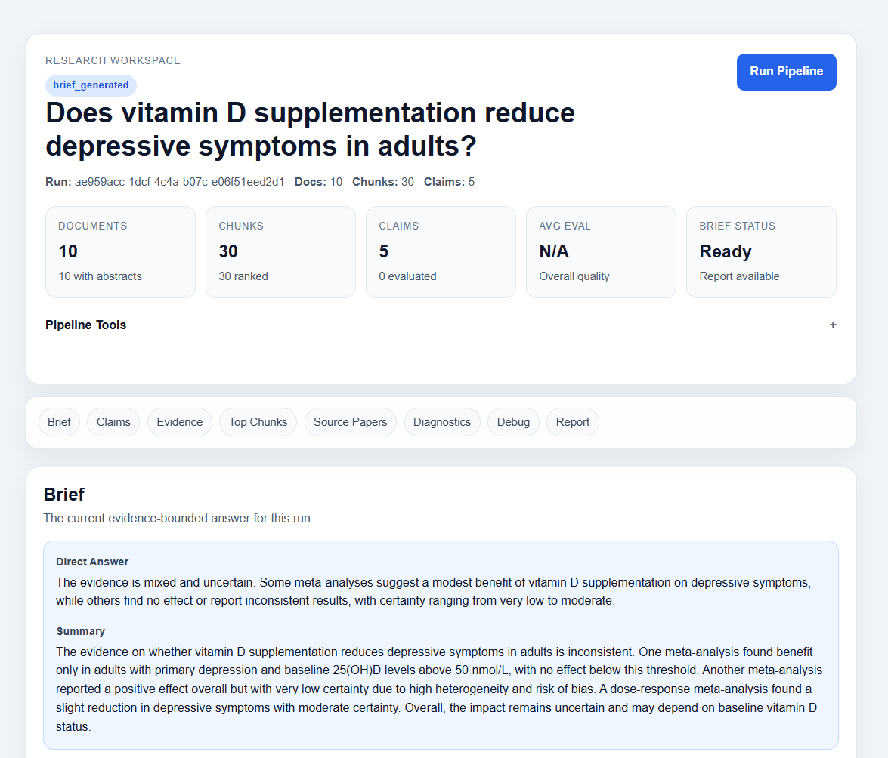
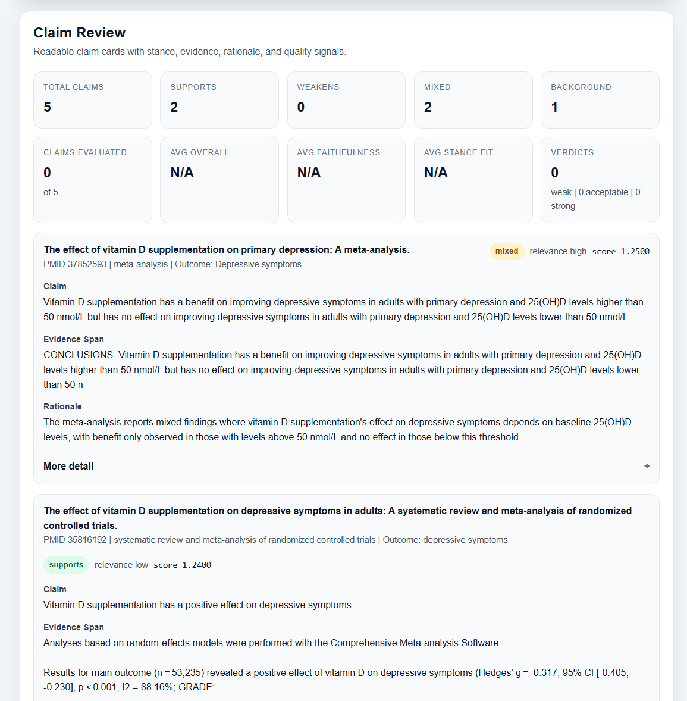
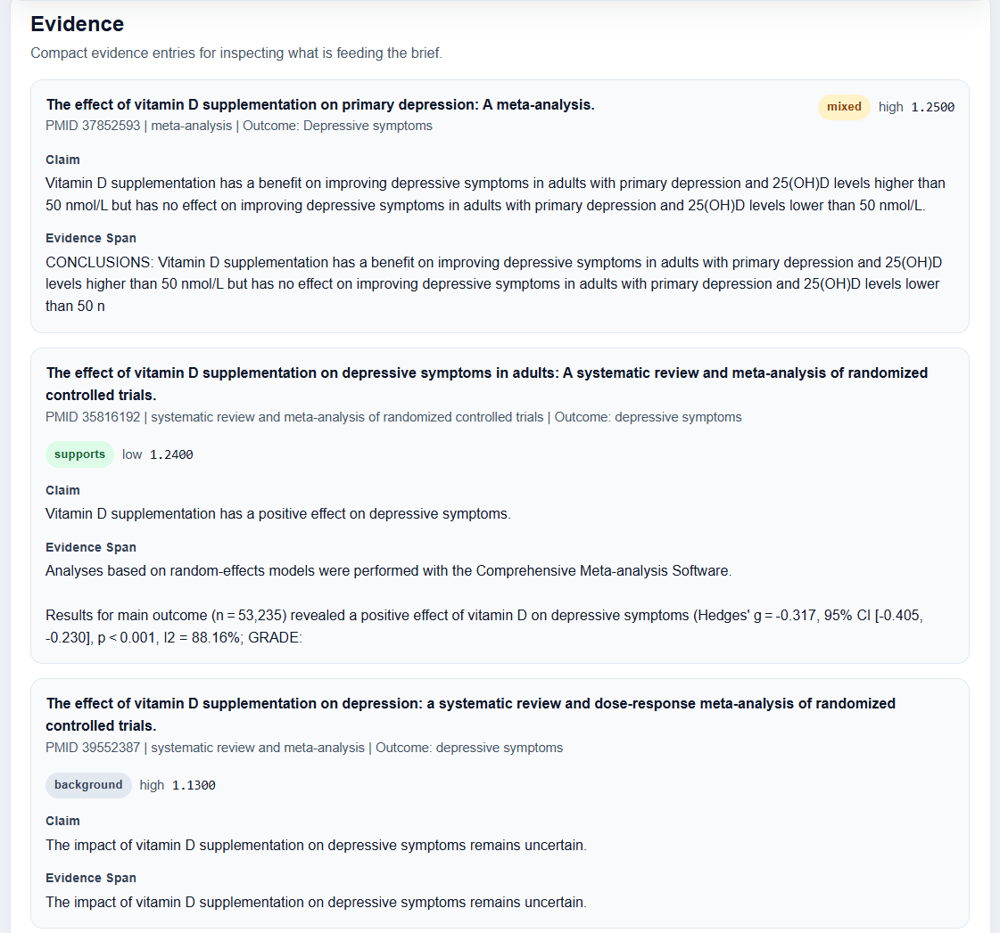
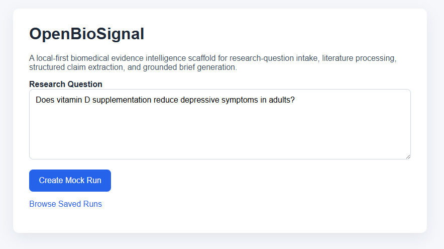

# OpenBioSignal

Open-source biomedical evidence intelligence workspace for PubMed search, claim extraction, evaluation, and grounded research briefs.

OpenBioSignal is a local-first research prototype for exploring biomedical literature with an evidence-aware pipeline. It searches PubMed, fetches abstracts, ranks evidence chunks, extracts structured claims, evaluates claim quality, and generates grounded evidence briefs with traceable support.

> This project is a research prototype for biomedical literature exploration. It is not medical advice, not a clinical decision tool, and should not be used as a substitute for professional judgment.

## Why this exists

Biomedical literature is noisy, heterogeneous, and difficult to synthesize quickly. Basic search and generic chat interfaces are often not enough when the goal is to inspect evidence, compare findings, and keep track of uncertainty.

OpenBioSignal explores a more evidence-aware workflow:

- search PubMed for relevant papers
- fetch and chunk abstracts locally
- rank evidence chunks against a research question
- extract one structured claim per top chunk
- evaluate claim quality automatically
- generate a grounded brief, evidence table, and markdown report

The goal is not to automate scientific truth. The goal is to build a more inspectable and useful workflow for navigating biomedical evidence.
## What It Does

Current pipeline:

1. Create a research run from a biomedical question.
2. Search PubMed and store candidate papers locally.
3. Fetch abstracts and chunk them into retrieval units.
4. Rank chunks with a lexical scorer plus lightweight result/conclusion boosts.
5. Extract one structured claim per top chunk.
6. Run automated claim evaluation for quality checks.
7. Generate an evidence brief, evidence view, and markdown report.

Key characteristics:

- FastAPI + Jinja server-rendered UI
- SQLite persistence for local runs and artifacts
- Inspectable claim review and evaluation workflow
- Research-output-first workspace UI with debug views available on demand
- Z.AI-backed structured generation through the OpenAI Python SDK compatibility layer

## Screenshots

### Workspace overview
The main research workspace for a run, showing the question, run status, key pipeline metrics, and the grounded brief generated from ranked evidence and extracted claims.



### Claim review
Structured claim cards with stance labels, evidence spans, rationale, and quality-review context for inspecting what the pipeline extracted from top-ranked chunks.



### Evidence view
Compact evidence cards showing the claims and supporting evidence spans that feed the generated brief.



### Research intake
The local-first entry point for creating a new research run from a biomedical question.



## Quickstart

Requirements:

- Python 3.11+
- a virtual environment tool such as `venv`
- a Z.AI API key for claim extraction, claim evaluation, and brief generation

Create a virtual environment.

Windows PowerShell:

```powershell
python -m venv .venv
.\.venv\Scripts\Activate.ps1
```

macOS / Linux:

```bash
python -m venv .venv
source .venv/bin/activate
```

Install dependencies:

```bash
pip install -r requirements.txt
```

Copy the environment template and fill in your local settings:

```bash
cp .env.example .env
```

Or on Windows PowerShell:

```powershell
Copy-Item .env.example .env
```

Start the app:

```bash
uvicorn app.main:app --reload
```

Open [http://127.0.0.1:8000](http://127.0.0.1:8000).

## Environment Variables

Important settings are documented in `.env.example`.

Common local values:

```env
APP_NAME=OpenBioSignal
APP_ENV=development
DATABASE_URL=sqlite:///./openbiosignal.db
LLM_PROVIDER=zai
ZAI_API_KEY=
ZAI_MODEL=glm-5
```

Notes:

- `ZAI_API_KEY` is required for claim extraction, claim evaluation, and brief generation.
- `OPENAI_*` placeholders remain documented for future provider flexibility, but the current app is configured for Z.AI-first local use.
- SQLite tables are created automatically on startup.

## Example Research Question

Try this as an initial end-to-end run:

> Does vitamin D supplementation reduce fracture risk in older adults?

Suggested test flow:

1. Create a run.
2. Click `Run Pipeline`.
3. Review the brief, claims, evidence cards, and evaluations on the run page.

## Current Status

This is an early research prototype, not a polished production system.

Current strengths:

- the local pipeline runs end to end
- the UI is usable for inspecting search, ranking, claims, evaluations, and briefs
- claim extraction and ranking are now more evidence-aware than the initial scaffold

## Current limitations

- Abstract-first pipeline for now; full-text support is limited
- Retrieval is currently lexical/heuristic rather than embedding-based
- Claim extraction and evaluation are still being iterated
- Automated evaluation is useful for debugging, not ground truth
- This is a research prototype, not a clinical or diagnostic tool

## Roadmap

Near-term priorities:

- improve retrieval quality and passage selection
- improve claim faithfulness and structured extraction consistency
- make brief synthesis more selective about weak claims
- add better local export and artifact packaging
- improve benchmark-style evaluation against curated examples

See `ROADMAP.md` for a concise project roadmap.

## Contributing

Contributions, issues, and feedback are welcome. See `CONTRIBUTING.md` for a lightweight starter guide.

## Disclaimer

OpenBioSignal is a research prototype for evidence synthesis workflows. It is not medical advice, not a diagnostic tool, and not a substitute for clinical judgment or expert literature review.
